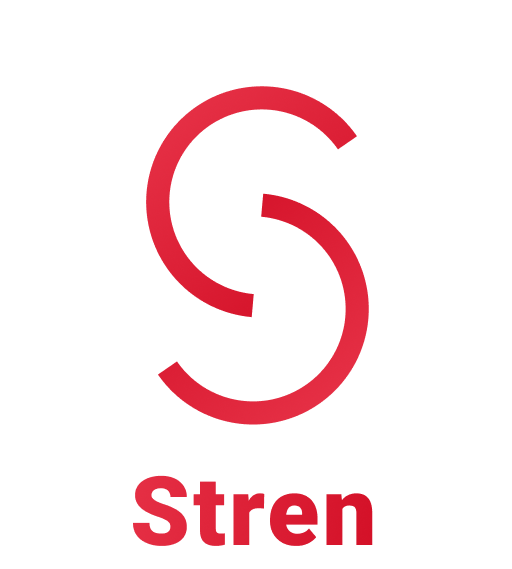

<h1 align="center">
  
</h1>

<h4 align="center">A mobile application for workouts and food logging</h4>

<p align="center">
    
    
    
</p>

<p align="center">
  <a href="#key-features">Key Features</a> •
  <a href="#how-to-run">How To Run</a> •
  <a href="#architecture">Architecture</a> •
  <a href="#package-structure">Package Structure</a> •
  <a href="#convention">Convention</a> •
  <a href="#framework-libraries-tools-and-resources">Framework, Libraries, Tools and Resources</a> •
  <a href="#author">Author</a> •
  <a href="#acknowledgement">Acknowledgement</a> •
</p>


## Key Features
### Available
* Signup with Facebook, Gmail
* View information of more than 800 exercises
* View workout history
* Log workout
* View foods' nutritional value
### Work in Progress
* Track nutrition and calories
### TODO
* View nutrition and training progress
* Record body measurements and view progress
* Log meals and track calories
* Track training and body measurements progess

## How To Run

1. To clone and run this application, you'll need [Git](https://git-scm.com) and [Android Studio](https://developer.android.com/studio/install) installed on your computer. 
You can clone the project using the terminal 

```bash
# Clone this repository
$ git clone https://github.com/Doan-Pham/Stren
```

then open the project in Android Studio. Or you can clone the project in Android Studio itself following this [guide](https://www.geeksforgeeks.org/how-to-clone-android-project-from-github-in-android-studio/).

2. Get [google-services.json](https://console.firebase.google.com/u/2/project/stren-55f4e/settings/general/android:com.haidoan.android.stren) from Firebase Console -> Project Settings and add to "app" directory
3. To use Sign in with Facebook/Google feature, add a "credentials.properties" file in the root project directory with the following content

```
FACEBOOK_APP_ID = [FACEBOOK_APP_ID]
FACEBOOK_LOGIN_PROTOCOL_SCHEME = [FACEBOOK_LOGIN_PROTOCOL_SCHEME]
FACEBOOK_CLIENT_TOKEN = [FACEBOOK_CLIENT_TOKEN]
GOOGLE_WEB_CLIENT_ID = [GOOGLE_WEB_CLIENT_ID]
```
4. Click Build -> Rebuild Project.
5. Click Run -> Run 'app'

## Architecture
The application's architecture follows the MVVM pattern based on [Now In Android's](https://github.com/android/nowinandroid/tree/main) [Architecture Learning Journey](https://github.com/android/nowinandroid/blob/main/docs/ArchitectureLearningJourney.md) but without a local database and support for offline usage.

## Package Structure
The application's overall package structure follows [Now In Android's](https://github.com/android/nowinandroid/tree/main) [Modularization learning journey](https://github.com/android/nowinandroid/blob/main/docs/ModularizationLearningJourney.md)
with some modifications as the application doesn't utilize modularization yet.
In general, there are 3 types of packages:
* `app:` Entry point of the application. Handles the top-level logic (Top-level navigation, top-level state) .
* `feat:` Include classes and functions related to a feature (or feature group).
* `core:` Include classes and functions that are used by many different `feat` and `app` packages (Ex: [designsystem/component](https://github.com/Doan-Pham/Stren/tree/README/app/src/main/java/com/haidoan/android/stren/core/designsystem/component) contains common UI components)

## Convention
The application's conventions loosely follow the following guidelines:
- Kotlin: [kodecocodes-kotlin-style-guide](https://github.com/kodecocodes/kotlin-style-guide).
- Git Branch Naming: [Git Branch Naming Convention](https://dev.to/couchcamote/git-branching-name-convention-cch).
- Git Commit Message: [Contributing to Angular](https://github.com/angular/angular/blob/22b96b9/CONTRIBUTING.md#-commit-message-guidelines).

## Framework, Libraries, Tools and Resources
- Framework: [Android](https://www.android.com/) ([Kotlin](https://kotlinlang.org/)).
- UI Toolkit: [Jetpack Compose](https://developer.android.com/jetpack/compose?gclid=Cj0KCQjw6cKiBhD5ARIsAKXUdyb-Ol7pdUNLEEqp8HC9iHwudsHWUp-2Ppta7Kv9tT78WbryuKQEz4EaAkF9EALw_wcB&gclsrc=aw.ds).
- UI Design: [Figma](https://www.figma.com/) and [Material Design 3](https://m3.material.io/).
- Dependency Injection: [Hilt](https://dagger.dev/hilt/).
- Pagination: [Paging 3](https://developer.android.com/topic/libraries/architecture/paging/v3-overview).
- Testing: [JUnit](https://junit.org/junit4/).
- Network: [Retrofit](https://square.github.io/retrofit/), [kotlinx.serialization](https://github.com/Kotlin/kotlinx.serialization).
- Authentication, Database and Storage: [Firebase](https://firebase.google.com/).
- Exercise Dataset: [free-exercise-db](https://github.com/yuhonas/free-exercise-db).
- Food Dataset: [FoodData Central API](https://fdc.nal.usda.gov/api-guide.html).
- Upload Dataset to Firebase: [firestore-backup-restore](https://github.com/dalenguyen/firestore-backup-restore).
- Icons: [Severicons](https://www.figma.com/community/file/929620430222653376/Severicons---Essential-icon-set).

## Author
 [**Pham Truong Hai Doan**](https://github.com/Doan-Pham)

## Acknowledgement
  - The application takes inspiration from the following products: [Strong](https://www.strong.app/), [Hevy](https://www.hevyapp.com/), [FitNotes](http://www.fitnotesapp.com/), [Cronometer](https://cronometer.com/), [MyFitnessPal](https://www.myfitnesspal.com/).
  - The application heavily uses [Now In Android](https://github.com/android/nowinandroid) as a reference for coding style, coding patterns, and sample code.
  
