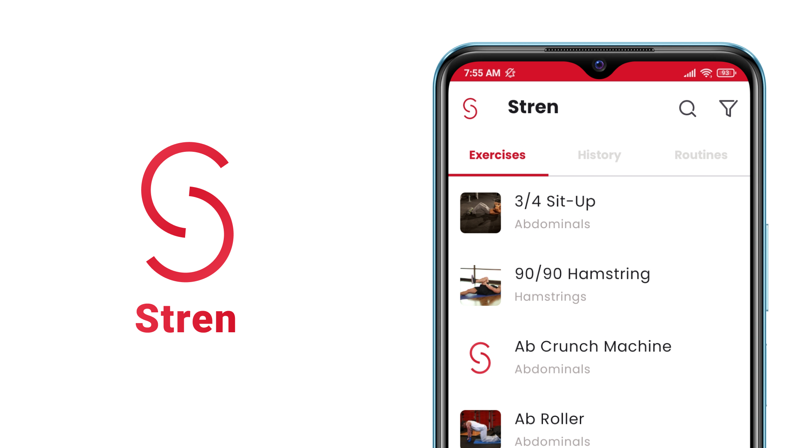

<h1 align="center">
  
</h1>

<h4 align="center">A mobile application for workouts and food logging</h4>

<p align="center">
    
    
    
</p>

<p align="center">
  <a href="#key-features">Key Features</a> •
  <a href="#how-to-run">How To Run</a> •
  <a href="#architecture">Architecture</a> •
  <a href="#package-structure">Package Structure</a> •
  <a href="#convention">Convention</a> •
  <a href="#framework-libraries-tools-and-resources">Framework, Libraries, Tools and Resources</a> •
  <a href="#author">Author</a> •
  <a href="#acknowledgement">Acknowledgement</a> •
</p>



## Key Features
### Available
* Signup with Facebook, Gmail
* View information of more than 800 exercises
* View workout history
* Log workout
* View nutritional values of more than 400,000 foods
* Full-text search for exercises and foods
* Track nutrition and calories
* View training and nutrition progress
* Track biometrics
### Work in Progress
* Record body measurements and view progress

## How To Run

1. To clone and run this application, you'll need [Git](https://git-scm.com) and [Android Studio](https://developer.android.com/studio/install) installed on your computer. 
You can clone the project using the terminal 

```bash
# Clone this repository
$ git clone https://github.com/Doan-Pham/Stren
```

then open the project in Android Studio. Or you can clone the project in Android Studio itself following this [guide](https://www.geeksforgeeks.org/how-to-clone-android-project-from-github-in-android-studio/).

2. Get [google-services.json](https://console.firebase.google.com/u/2/project/stren-55f4e/settings/general/android:com.haidoan.android.stren) from Firebase Console -> Project Settings. Then add this file to project's "app" directory
3. To use Sign in with Facebook/Google feature, add a "credentials.properties" file in the root project directory with the following content

```
FACEBOOK_APP_ID = [FACEBOOK_APP_ID]
FACEBOOK_LOGIN_PROTOCOL_SCHEME = [FACEBOOK_LOGIN_PROTOCOL_SCHEME]
FACEBOOK_CLIENT_TOKEN = [FACEBOOK_CLIENT_TOKEN]
GOOGLE_WEB_CLIENT_ID = [GOOGLE_WEB_CLIENT_ID]
```
4. Get an API Key for FDC following this guide: https://fdc.nal.usda.gov/api-guide.html (Part 3 - Gaining Access)
5. Add a "api_key.properties" file in the root project directory with the following content:
```
FDC_API_KEY = "[THE_API_KEY_YOU_JUST_GET]"
```
6. Congigure Firestore to use [Search Firestore with Algolia extension](https://extensions.dev/extensions/algolia/firestore-algolia-search), following these guides: [firestore-algolia-search](https://github.com/algolia/firestore-algolia-search), [Đồng bộ data từ Cloud Firestore lên Algolia thông qua Firebase Functions](https://viblo.asia/p/dong-bo-data-tu-cloud-firestore-len-algolia-thong-qua-firebase-functions-3P0lP9Om5ox) (You can skip step 3, since the extension already handles the synchronization).
7. Add these 2 lines to "api_key.properties" file from 5.
```
ALGOLIA_APPLICATION_ID = "[YOUR_APPLICATION_ID]"
ALGOLIA_SEARCH_API_KEY = "[YOUR_SEARCH_API_KEY]"
```
8. In Android Studio, click Build -> Rebuild Project.
9. Click Run -> Run 'app'

## Architecture
The application's architecture follows the MVVM pattern based on [Now In Android's](https://github.com/android/nowinandroid/tree/main) [Architecture Learning Journey](https://github.com/android/nowinandroid/blob/main/docs/ArchitectureLearningJourney.md) but without a local database and support for offline usage.

## Package Structure
The application's overall package structure follows [Now In Android's](https://github.com/android/nowinandroid/tree/main) [Modularization learning journey](https://github.com/android/nowinandroid/blob/main/docs/ModularizationLearningJourney.md)
with some modifications as the application doesn't utilize modularization yet.
In general, there are 3 types of packages:
* `app:` Entry point of the application. Handles the top-level logic (Top-level navigation, top-level state) .
* `feat:` Include classes and functions related to a feature (or feature group).
* `core:` Include classes and functions that are used by many different `feat` and `app` packages (Ex: [designsystem/component](https://github.com/Doan-Pham/Stren/tree/dev/app/src/main/java/com/haidoan/android/stren/core/designsystem/component) contains common UI components)

## Convention
The application's conventions loosely follow the following guidelines:
- Kotlin: [kodecocodes-kotlin-style-guide](https://github.com/kodecocodes/kotlin-style-guide).
- Git Branch Naming: [Git Branch Naming Convention](https://dev.to/couchcamote/git-branching-name-convention-cch).
- Git Commit Message: [Contributing to Angular](https://github.com/angular/angular/blob/22b96b9/CONTRIBUTING.md#-commit-message-guidelines).

## Framework, Libraries, Tools and Resources
### Core Framework and Libraries
- Framework: [Android](https://www.android.com/) ([Kotlin](https://kotlinlang.org/)).
- UI Toolkit: [Jetpack Compose](https://developer.android.com/jetpack/compose?gclid=Cj0KCQjw6cKiBhD5ARIsAKXUdyb-Ol7pdUNLEEqp8HC9iHwudsHWUp-2Ppta7Kv9tT78WbryuKQEz4EaAkF9EALw_wcB&gclsrc=aw.ds), [Material Design 3](https://m3.material.io/).
- Authentication, Database and Storage: [Firebase](https://firebase.google.com/).
- Dependency Injection: [Hilt](https://dagger.dev/hilt/).
- Testing: [JUnit](https://junit.org/junit4/).
- Pagination: [Paging 3](https://developer.android.com/topic/libraries/architecture/paging/v3-overview).
- Network: [Retrofit](https://square.github.io/retrofit/), [kotlinx.serialization](https://github.com/Kotlin/kotlinx.serialization).
- Logging: [Timber](https://github.com/JakeWharton/timber).
### Other Libraries and Tools
- UI Design: [Figma](https://www.figma.com/).
- Full-text Search: [algolia](https://www.algolia.com/).
- Validation: [commons-validator](https://github.com/apache/commons-validator).
- Chart and Graph UI Components: [charts](https://github.com/tehras/charts), [vico](https://github.com/patrykandpatrick/vico).
- Calendar UI Component: [Calendar](https://github.com/kizitonwose/Calendar), [sheets-compose-dialogs](https://github.com/maxkeppeler/sheets-compose-dialogs).
- Navigation Transition: [Accompanist](https://github.com/google/accompanist).
- Image Loader: [Coil](https://github.com/coil-kt/coil).
- Licenses: [AboutLibraries](https://github.com/mikepenz/AboutLibraries).
### Resources
- Exercise Dataset: [free-exercise-db](https://github.com/yuhonas/free-exercise-db).
- Food Dataset: [FDC API](https://fdc.nal.usda.gov/api-guide.html) (U.S. Department of Agriculture, Agricultural Research Service. FoodData Central, 2019. [fdc.nal.usda.gov](https://fdc.nal.usda.gov/)).
- Upload Dataset to Firebase: [firestore-backup-restore](https://github.com/dalenguyen/firestore-backup-restore).
- Icons: [Severicons](https://www.figma.com/community/file/929620430222653376/Severicons---Essential-icon-set).
- Calories Caculation: [mohap.gov.ae](https://mohap.gov.ae/en/more/awareness-center/calories-calculation#:~:text=To%20determin%E2%80%8Be%20your,Calorie%2DCalculation%20%3D%20BMR%20x%201.375), [TDEE Calculator](https://tdeecalculator.net/result.php?s=imperial&age=30&g=female&lbs=114&in=61&act=1.2&bf=&f=1), [Calculator.net](https://www.calculator.net/calorie-calculator.html).
## Author
 [**Pham Truong Hai Doan**](https://github.com/Doan-Pham)

## Acknowledgement
  - The application takes inspiration from the following products: [Strong](https://www.strong.app/), [Hevy](https://www.hevyapp.com/), [FitNotes](http://www.fitnotesapp.com/), [Cronometer](https://cronometer.com/), [MyFitnessPal](https://www.myfitnesspal.com/).
  - The application heavily uses [Now In Android](https://github.com/android/nowinandroid) as a reference for coding style, coding patterns, and sample code.
  
